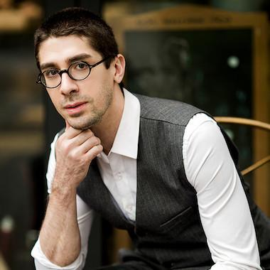

I'm a researcher and engineer. My work and interests span security, privacy, machine learning, artificial intelligence, human-computer interaction, and biologically-inspired computing.

Some of my open source projects include:

* [kloak](https://github.com/vmonaco/kloak), a privacy tool that obfuscates keystroke and mouse input event timings, making keystroke biometrics and device fingerprinting less effective.
* [frailtySurv](https://github.com/vmonaco/frailtySurv), an R package for simulating and fitting semiparametric shared frailty models.
* [pohmm](https://github.com/vmonaco/pohmm), a Python package that implements the partially observed hidden Markov model (POHMM).

I currently work on data privacy at [OpenAI](https://openai.com/). Previously, I was a Lead Data Scientist at [Visa](https://usa.visa.com/), Assistant Professor at the [Naval Postgraduate School](https://nps.edu/web/cs), and Computer Scientist at the [U.S. Army Research Laboratory](https://www.arl.army.mil/).

# News
***
* I joined OpenAI (July 2022)

# Old news
***
* I joined Visa Inc. as a lead data scientist (November 2021)
* Paper on device fingerprinting accepted to [S&P'22](http://www.ieee-security.org/TC/SP2022)
* Program Co-Chair of the 2021 [SADFE](http://sadfe.org/) Workshop
* Best Paper @ [CHI'20](https://chi2020.acm.org/) for work in [covert impairments in HCI](https://dl.acm.org/doi/abs/10.1145/3313831.3376832)
* Member of the [SecureComm'20](http://securecomm.org/call-for-papers/) Program Committee
* Paper on scaling up keystroke biometrics accepted to [IJCB'20](https://ieee-biometrics.org/ijcb2020/)
* Member of the [WTMC'20](http://wtmc.info/index.html) Program Committee
* Invited talk for the Rotary Club of Corral de Tierra (July 2020)
* Paper on covert impairments in human computer interaction accepted to [CHI'20](https://chi2020.acm.org/)
* Invited talk at the Sunset Center (Carmel, CA), hosted by the [Carmel Public Library Foundation](https://carmelpubliclibraryfoundation.org/events/upcoming-events-activities/) (February 2020) \[[slides](/slides/Big_data_big_brother.pdf)\]
* Autocomplete side channel paper accepted to [USENIX'19](https://www.usenix.org/conference/usenixsecurity19)
* Member of the [WTMC'19](http://wtmc.info/index2019.html) Program Committee
* Invited talk at the 20th Monterey Workshop on Cyber (November 2018)
* Joined NPS as an Assistant Professor of Computer Science (August 2018)
* SoK paper on keylogging side channels accepted to [S&P'18](https://www.ieee-security.org/TC/SP2018/)
* Best Paper @ [ISCAS'17](http://iscas2017.org/) for work on [factoring integers with a neuromorphic processor](https://arxiv.org/pdf/1703.03768.pdf)

See also old [press](/press).

# Students
***
See [Calhoun](https://calhoun.nps.edu/discover?filtertype=advisor&filter_relational_operator=equals&filter=Monaco%2C+John) for a list of theses I advised.

# Awards
***
* Best paper, CHI'20
* Best Paper, ISCAS'17
* Best Paper, UEMCON'17
* Runner-up Neuromorph of the Year, [Telluride NCEW'16](http://telluride.iniforum.ch/2016/)
* 1st Place, [Keystroke Biometrics Ongoing Competition](https://sites.google.com/site/btas16kboc/home)
* 3rd Place, [Look & Click Competition](http://www.kasprowski.pl/lac/)
* 1st Place, [The Second Eye Movements Verification and Identification Competition](http://www.emvic.org)
* One of Westchester's [Top Professionals Under 30](http://www.westchestermagazine.com/914-INC/Q2-2013/Wunderkinds-2013-John-Vincent-Monaco-24/)

# Select publications
***

See the [full list](/publications) and [Google Scholar](http://scholar.google.com/citations?user=iG64YJUAAAAJ&hl=en).

* **Device Fingerprinting with Peripheral Timestamps** \\
*John V. Monaco* \\
43rd IEEE Symposium on Security and Privacy (S&P 2022)  \[[pdf](/papers/Device Fingerprinting with Peripheral Timestamps.pdf)\]

* **Bug or Feature? Covert Impairments to Human Computer Interaction** \\
*John V. Monaco* \\
2020 ACM Conference on Human Factors in Computing Systems (CHI 2020) **Best Paper Award (top 1%)** \[[pdf](/papers/Bug or Feature - Covert Impairments to Human Computer Interaction.pdf)\]

* **What Are You Searching For? A Remote Keylogging Attack on Search Engine Autocomplete** \\
*John V. Monaco* \\
28th USENIX Security Symposium (USENIX 2019) \[[pdf](/papers/What Are You Searching For- A Remote Keylogging Attack on Search Engine Autocomplete.pdf)\] \[[code](https://github.com/vmonaco/kreep/)\]

* **SoK: Keylogging Side Channels** \\
*John V. Monaco* \\
39th IEEE Symposium on Security and Privacy (S&P 2018) \[[pdf](/papers/SoK- Keylogging Side Channels.pdf)\]

* **Factoring Integers with a Brain-Inspired Computer** \\
*John V. Monaco*, Manuel M. Vindiola \\
IEEE Transactions on Circuits and Systems I, 2017 \[[pdf](/papers/Factoring Integers With a Brain-Inspired Computer.pdf)\]

* **The Partially Observable Hidden Markov Model and its Application to Keystroke Dynamics** \\
*John V. Monaco*, Charles C Tappert \\
Pattern Recognition, 2017 \[[pdf](/papers/The partially observable hidden Markov model and its application to keystroke dynamics.pdf)\]
