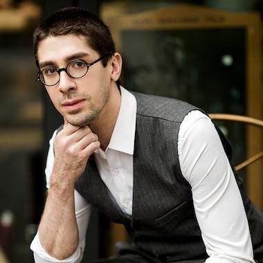

I am an Assistant Professor of Computer Science at the Naval Postgraduate School in Monterey, CA. I am interested in human aspects of security, especially those involving human-computer interaction, privacy on the Internet, information leakage in distributed systems, and side channel attacks. I also try to leverage brain-inspired computer architectures to solve computationally hard problems.

From 2016-2018, I was a Postdoc and then Computer Scientist at the U.S. Army Research Laboratory (ARL) at Aberdeen Proving Ground, MD, working on keylogging side channel attacks and neuromorphic computing.

# News
***
* Paper on covert impairments in human computer interaction accepted to [CHI'20](https://chi2020.acm.org/)
* Member of the [WTMC'20](http://wtmc.info/index.html) Program Committee

# Old news
* Invited talk at the Sunset Center (Carmel, CA), hosted by the [Carmel Public Library Foundation](https://carmelpubliclibraryfoundation.org/events/upcoming-events-activities/) (February 2020) \[[slides](/slides/Big_data_big_brother.pdf)\]
* Autocomplete side channel paper accepted to [USENIX'19](https://www.usenix.org/conference/usenixsecurity19)
* Member of the [WTMC'19](http://wtmc.info/index2019.html) Program Committee
* Invited talk at the 20th Monterey Workshop on Cyber (November 2018)
* Joined NPS as an Assistant Professor of Computer Science (August 2018)
* SoK paper on keylogging side channels accepted to [S&P'18](https://www.ieee-security.org/TC/SP2018/)
* Best Paper @ [ISCAS'17](http://iscas2017.org/) for work on [factoring integers with a neuromorphic processor](https://arxiv.org/pdf/1703.03768.pdf)

# Students
***

### MS students
* Rouben Azad (modeling ship behavior using AIS)
* Peter Goodwin (obfuscating keystroke dynamics)
* Michael Walker (author identification through text composition)
* Cassondra Bullock / Jeana Verkempinck / Alexander Arnell (information leakage in chat application network traffic)
* Yao Wen Loy (Air Force, Singapore) / Zhenfeng Lee (Singapore) (behavioral Bitcoin address clustering heuristics)
* Greg Bunder / Michael Laws (network traffic anomaly detection)
* John Smith / Nicholas Hughes (digital signatures on darknet marketplaces)
* Brett Rajchel (network traffic monitoring for insider threat detection)
* Eric Kim (biologically-inspired automatic target detection, classification, and tracking)
* Xisen Tian (radar imagery deep fakes through a man-in-the-middle attack)

### MS Alumni
* Mark Veazey (Internet-scale keystroke biometrics and privacy)
* Ryan Keller (modeling trust between human and AI)
* Nathan Richardson / Lucas Burke (eliciting identifying behavior from a social engineer)

# Teaching
***
* AY20 spring: Artificial Intelligence (CS3310)
* AY20 fall: Artificial Intelligence (CS3310)
* AY19 spring: Artificial Intelligence (CS3310) and Machine Learning/Data Mining (CS4315)
* AY19 winter: Artificial Intelligence (CS3310)
* AY19 fall: Artificial Intelligence (CS3310)

# Awards
***
* Best Paper, ISCAS'17
* Best Paper, UEMCON'17
* Runner-up Neuromorph of the Year, [Telluride NCEW'16](http://telluride.iniforum.ch/2016/)
* 1st Place, [Keystroke Biometrics Ongoing Competition](https://sites.google.com/site/btas16kboc/home)
* 3rd Place, [Look & Click Competition](http://www.kasprowski.pl/lac/)
* 1st Place, [The Second Eye Movements Verification and Identification Competition](http://www.emvic.org)
* One of Westchester's [Top Professionals Under 30](http://www.westchestermagazine.com/914-INC/Q2-2013/Wunderkinds-2013-John-Vincent-Monaco-24/)

# Select publications
***

See the [full list](/publications) and [Google Scholar](http://scholar.google.com/citations?user=iG64YJUAAAAJ&hl=en).

* **Bug or Feature? Covert Impairments to Human Computer Interaction** \\
*John V. Monaco* \\
2020 ACM Conference on Human Factors in Computing Systems (CHI 2020) \[[pdf](/papers/Bug or Feature - Covert Impairments to Human Computer Interaction.pdf)\]

* **What Are You Searching For? A Remote Keylogging Attack on Search Engine Autocomplete** \\
*John V. Monaco* \\
28th USENIX Security Symposium (USENIX 2019) \[[pdf](/papers/What Are You Searching For- A Remote Keylogging Attack on Search Engine Autocomplete.pdf)\] \[[code](https://github.com/vmonaco/kreep/)\]

* **SoK: Keylogging Side Channels** \\
*John V. Monaco* \\
39th IEEE Symposium on Security and Privacy (S&P 2018) \[[pdf](/papers/SoK- Keylogging Side Channels.pdf)\]

* **Factoring Integers with a Brain-Inspired Computer** \\
*John V. Monaco*, Manuel M. Vindiola \\
IEEE Transactions on Circuits and Systems I, 2017 \[[pdf](/papers/Factoring Integers With a Brain-Inspired Computer.pdf)\]

* **The Partially Observable Hidden Markov Model and its Application to Keystroke Dynamics** \\
*John V. Monaco*, Charles C Tappert \\
Pattern Recognition, 2017 \[[pdf](/papers/The partially observable hidden Markov model and its application to keystroke dynamics.pdf)\]

# Contact
***
Email: contact at [this domain]

Find me on:

*   [Twitter](https://twitter.com/vinmonaco)
*   [Github](https://github.com/vmonaco)
*   [ResearchGate](https://www.researchgate.net/profile/Vinnie_Monaco)
*   [LinkedIn](http://www.linkedin.com/in/vmonaco)
*   [Google Scholar](http://scholar.google.com/citations?user=iG64YJUAAAAJ&hl=en)
